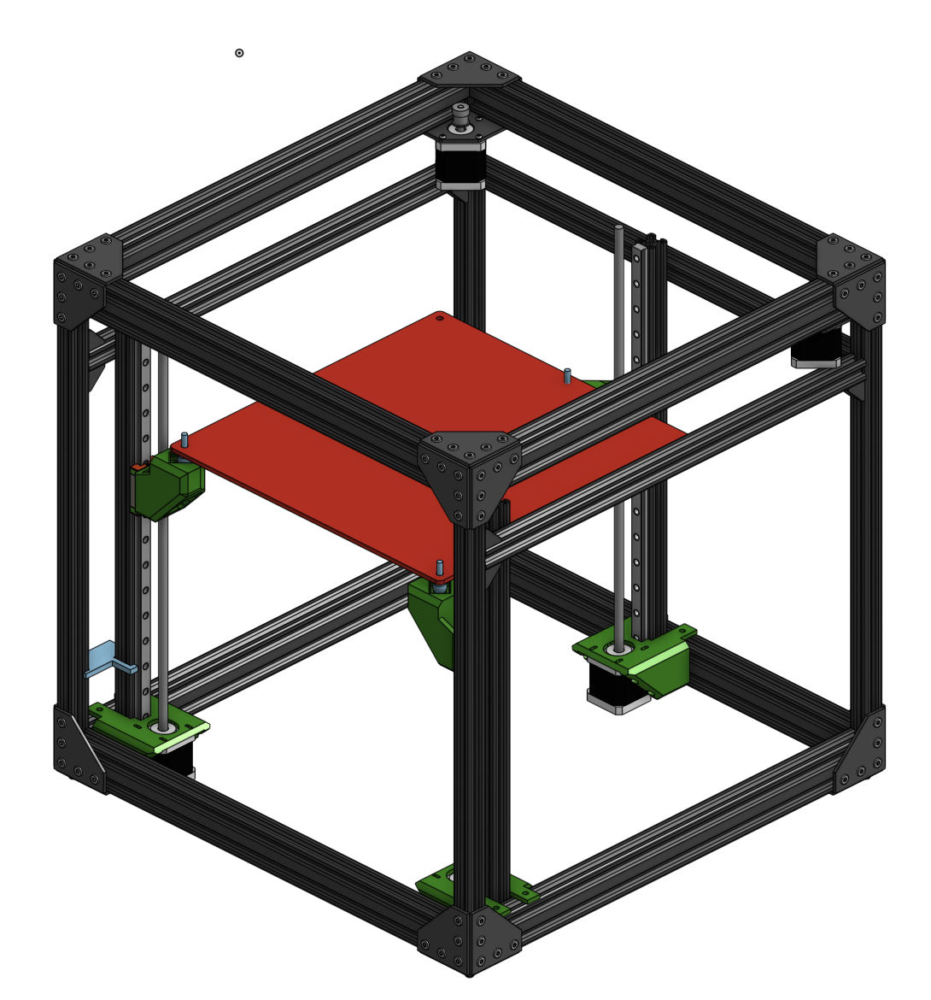

# vCore2-kinematic-bed

This project implements a kinematic bed solution for the RatRig vCore2, it designed to be used with [easy mod](https://github.com/EVA-3D/easy-mod) and [EVA](https://pkucmus.github.io/EVA/) for XY motion.

# Variants

- [MGN12H](./stl/mgn12h) - Tested
- [MGN15C](./stl/mgn15c) - Untested
- [MGN15H](./stl/mgn15h) - Untested

# Bill of materials

- 3x mgn rail + carriage with `Z motion length` + 100mm
    - [Tested with](https://www.banggood.com/Machifit-MGN12-100-1000mm-Linear-Rail-Guide-with-MGN12H-Linear-Sliding-Guide-Block-CNC-Parts-p-1156260.html?rmmds=myorder&ID=515971&cur_warehouse=UK) - cheap with EU wear house, not the best quality
- 3x 12mm sphere with 5mm thead
    - [Tested with](https://www.ratrig.com/steel-ball-12mm-threaded-m5.html)
- 3x 4mm aluminum spacer 5mm bore
    - [Tested with](https://www.ratrig.com/aluminium-spacer-40mm.html)
- 3x m5 12mm flat/countersunk screws
- 6x 3mm x 40mm dowel pins
    - [Tested with](https://www.ratrig.com/dowel-pin-3-0mm-x-40-0mm.html)
- 3x 10mm x 20mm x 4.8mm magnets with 2 4mm holes
    - Provided by RatRig, no link at the moment but the 3d model is [here](./assets/magnet.stl)
- 1x `Z motion length` + 160mm 2020 aluminum extrusion
    - One of the four original Z rails can be cut to length

# Modifications

- A 3rd hole was done in the bed plate to interface with the center rail in the back
- All the bed plate holes were chamfered to embed the countersunk screws
    - This step is not mandatory if you don't use a full glass bed
- One of the original vertical Z rail extrusion was cut to length (`Z motion length` + 160mm)

# Printed parts

- 3x Motor holder
- 1x Right Holder
- 1x Left Holder
- 1x Back Holder
- 2x Alignment jig

# Assembly photos

There is an [Album](https://photos.google.com/album/AF1QipPb8UzY6MsozT46tPPoFIl3qnk6D_y54e8xmwLS) with some assembly pictures, not the best o more descriptive

# Sources

https://cad.onshape.com/documents/498b6fb757259c8f1d1f64b7/w/7653b27b7ea7c391e082a810/e/2b3cc91744991a6a9c3920e2

# Contributing

- If you have any doubts or have found any problems just open an issue
- If you have any modifications make a pull request
- If you enjoyed the project buy me a [coffee](https://paypal.me/eduardoliveira2009)

# Special Thanks to:
- My wife for putting up with all the assembly, testing and printing done in the living room.
- Jorge Lino, a friend that helped me with all the drilling and cutting that "can't" be done in the living room.
- [RatRig](https://www.ratrig.com/) for offering the spheres, dowel pins, magnets and some screws.
- McAbra for [easy mod](https://github.com/EVA-3D/easy-mod), [EVA](https://pkucmus.github.io/EVA/) and the awesome onshape vitamins

